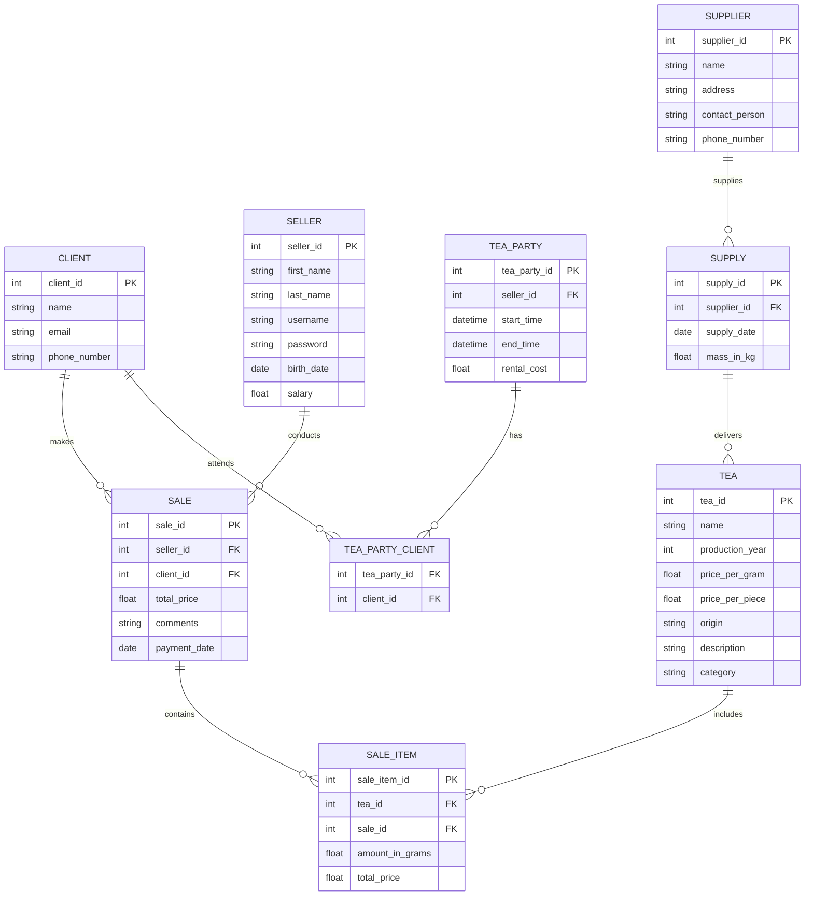

# Техническое задание

## Система управления магазином китайского чая

### Введение

Целью проекта является разработка системы управления магазином китайского чая, которая обеспечит автоматизацию основных
бизнес-процессов, улучшение управления запасами, повышение уровня обслуживания клиентов и увеличение эффективности
работы магазина.

Магазин китайского чая занимается продажей различных сортов чая, аксессуаров для чаепития и сопутствующих товаров. В
дополнение к этому магазин проводит чайные церемонии для своих клиентов. Основные задачи магазина включают управление
ассортиментом, учёт продаж, взаимодействие с клиентами и поставщиками.

### Функциональные требования

Система состоит из нескольких функциональных блоков:

1. Администрирование
    1. Управление пользователями
    2. Управление товарами
    3. Управление заказами
    4. Управление поставщиками
2. Взаимодействие с клиентами
3. Организация чайных церемоний
4. Отчётность и аналитика

#### Типы пользователей

Система предусматривает 3 вида пользователей: администратор, продавец и клиент. Администратор управляет товарами и
складом, пользователями системы, поставками, анализирует продажи и формирует отчёты. Продавцы обрабатывают продажи,
консультируют клиентов и управляют бронью на чайные церемонии. Клиенты могут просматривать и бронировать товары (покупка
не предусмотрена), бронировать зал для чайных церемоний, отслеживать историю покупок и чайных церемоний.

#### Управление товарами

Сначала администратор добавляет новые товары в систему, вводя информацию о каждом продукте, включая название, сорт,
происхождение, цену за грамм и за штуку, год сбора, описание и количество на складе. Эта информация хранится в базе
данных и обновляется по мере необходимости.

В случае продажи товара, продавец регистрирует продажу в системе, что автоматически обновляет количество товара на
складе, уменьшая его на проданное количество.

Администраторы могут добавлять новых поставщиков, обновлять их контактные данные и регистрировать новые поставки. При
получении новой партии товара от поставщика, администратор регистрирует поставку в системе, указывая дату поставки,
массу и другие детали. Это приводит к обновлению количества соответствующих товаров на складе.

Для каждого товара заводится 2 записи: в блинах и в граммах. Блины могут конвертироваться в граммы.

Система позволяет генерировать отчеты о текущих остатках товаров и других важных показателях.

#### Управление продажами

Продавец регистрирует каждую продажу в системе, вводя информацию о проданных товарах, их количестве, общей сумме
продажи, а также данные о покупателе, если он зарегистрирован в системе.

При регистрации продажи система автоматически обновляет количество проданного товара на складе. Каждая продажа
фиксируется с указанием даты и времени.

Администраторы и продавцы могут создавать отчеты о продажах за определенные периоды, анализировать выручку, количество
проданных товаров и другие ключевые показатели.

Если клиент возвращает товар, продавец регистрирует возврат в системе, что корректирует данные о продажах и
восстанавливает количество товара на складе.

Система позволяет генерировать отчеты о продажах за определенные периоды и других важных показателях.

С началом продажи чай бронируется за продавцом до закрытия продажи, чтобы его не могли заказать во время продажи.

#### Взаимодействие с клиентами

Клиенты могут регистрироваться в системе, предоставляя свои контактные данные, такие как имя, номер телефона и
электронная почта.

Вход в систему происходит через код с почты.

Администраторы могут просматривать, редактировать, удалять и создавать профили клиентов. В системе также ведется история
покупок каждого клиента.

Система поддерживает отправку уведомлений и напоминаний. Клиенты могут получать информацию о предстоящих акциях, новых
поступлениях товаров, а также напоминания о запланированных чайных церемониях.

Система позволяет генерировать отчёты по пользователям.

#### Организация чайных церемоний

Клиенты могут записываться на чайные церемонии через систему, выбирая удобное для них время и дату. Продавцы
регистрируют эти записи, фиксируя данные о клиенте, выбранной церемонии, забронированном чае и количестве участников.
В системе хранится информация о каждой церемонии, включая дату, время начала и окончания, продавца, который будет
проводить церемонию, и стоимость участия.

Продавцы могут управлять записями на церемонии, редактировать данные или отменять записи в случае необходимости.

Система также автоматически проверяет, чтобы даты и времена проведения церемоний не пересекались.

После завершения церемонии информация о проведенном мероприятии сохраняется.

Система поддерживает отправку напоминаний о предстоящих церемониях. Клиенты получают уведомления о времени и месте
проведения мероприятия, что помогает избежать пропусков.

Организация чайных церемоний также включает возможность генерации отчетов о проведенных мероприятиях.

#### Бронирование товара

Клиенты могут выбрать товары для бронирования через интерфейс системы, указав необходимые параметры, такие как
количество. Время хранения 5 дней. При этом количество забронированных товаров временно уменьшается в системе,
чтобы избежать их продажи другим клиентам. В интерфейсе продавца это указывается.

Клиенты получают напоминания о сроках, в течение которых они могут забрать зарезервированные товары.

В случае отмены бронирования количество товара на складе автоматически восстанавливается.

### Технологические требования

#### Frontend

- Фреймворк: Vite
- Язык: TypeScript
- Управление состоянием: Zustand
- Маршрутизация: React Router
- Документация (возможно): Storybook
- Тестирование (возможно): Chromatic

#### Backend

- Фреймворк: NestJS
- Язык: TypeScript
- СУБД: PostgreSQL
- ORM: TypeORM
- Тестирование: Jest

### Пользовательский интерфейс

https://www.figma.com/design/KipDdmwONXNH7lOPEcRfIv

### План разработки и внедрения

**Этапы разработки**:

1. Согласование требований
2. Анализ и проектирование системы
3. Разработка
    1. Разработка интерфейсов для администраторов, продавцов и клиентов
    2. Создание базы данных для хранения информации о товарах, клиентах, поставщиках и мероприятиях
    3. Внедрение системы учёта товаров и продаж
    4. Разработка модуля для организации и управления чайными церемониями
4. Тестирование
5. Написание документации
6. Внедрение

**Сроки выполнения работ**: 6 месяцев

### Приложения

#### ER-диаграмма

